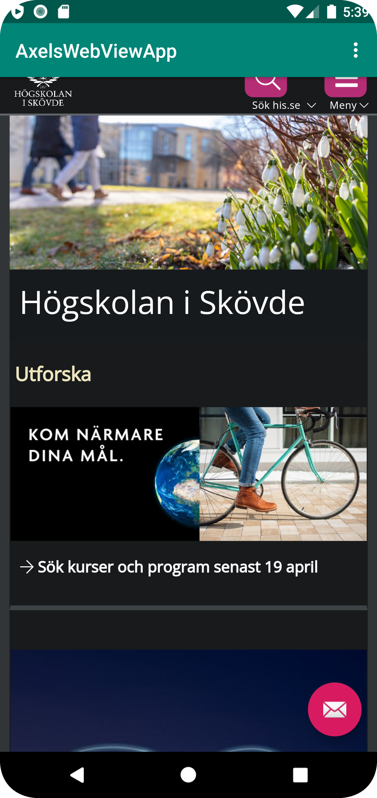
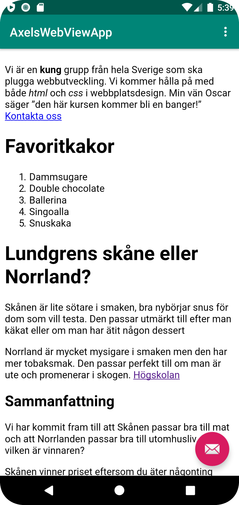

# Rapport

Först så gjorde ändrade jag namn, lade bara till axels innan ursprungsnamnet i strings.xml.
Efter det så skulle man göra så att appen kan komma åt internet. Koden för detta fanns i display external page som en slide så var inge svårigheter

Sedan tog jag bort hela textviewen som redan fanns i koden och böt ut den mot en webview. Allt som sedan kom upp sade jag bara ja till
Id lade jag sedan in inom samma tagg

Skapade en privat member variable inom public class
sen för att hitta my_webvew idt som jag lade till innan så skrev tog jag denna kod som ni gav ut:
```
myWebView = findViewById(R.id.my_webview);
myWebView.setWebViewClient(new WebViewClient()); // Do not open in Chrome!
```

Javascript funktionen lurkade jag fram med hintarna som ni gav. Såhär skrev jag:
```
myWebView.getSettings().setJavaScriptEnabled(true);
```

Html löste jag med att skapa en asset folder och sedan i den gjorde jag en html som heter about.html. I den klistrade jag bara in en gammal kod då det bara ska vara ett exempel

Internt och extern gjorde jag på detta vis:
Externt var lätt då jag bara skrev in url för his.se
Internt dock måste man skriva in det internt så skrev: file:///android_asset/about.html för att den ska kunna hitta min html

Sedan för att appen ska fatta vart den ska när man klickar på länkarna så lade jag till showExternalWebPage(); och showInternalWebPage(); i respektive if tagg som i nedan:

``
public boolean onOptionsItemSelected(MenuItem item) {
        // Handle action bar item clicks here. The action bar will
        // automatically handle clicks on the Home/Up button, so long
        // as you specify a parent activity in AndroidManifest.xml.
        int id = item.getItemId();

        //noinspection SimplifiableIfStatement
        if (id == R.id.action_external_web) {
            showExternalWebPage();
            Log.d("==>","Will display external web page");
            return true;
        }

        if (id == R.id.action_internal_web) {
            showInternalWebPage();
            Log.d("==>","Will display internal web page");
            return true;
        }

        return super.onOptionsItemSelected(item);
    }
``





